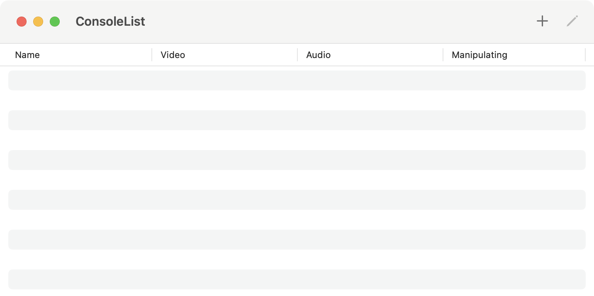
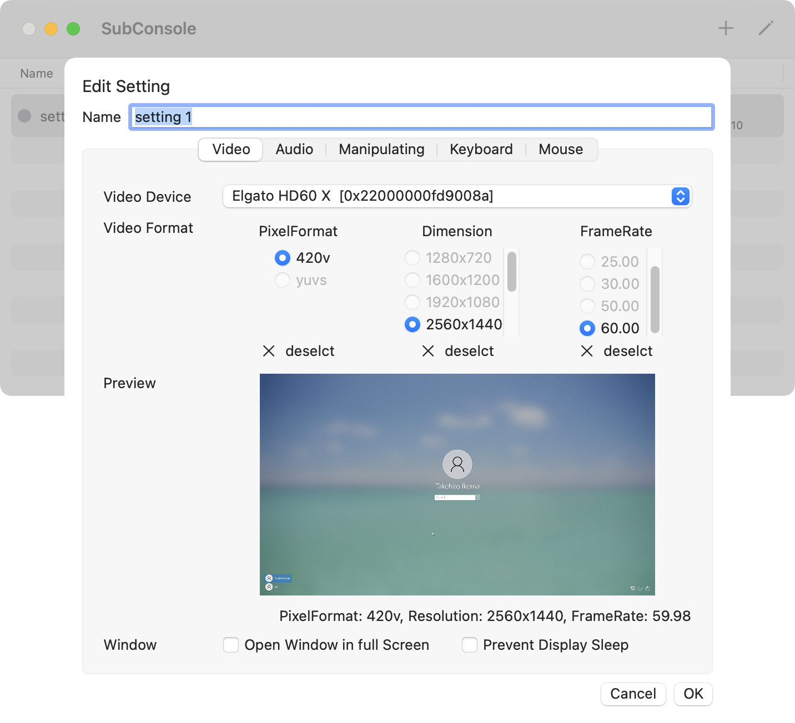
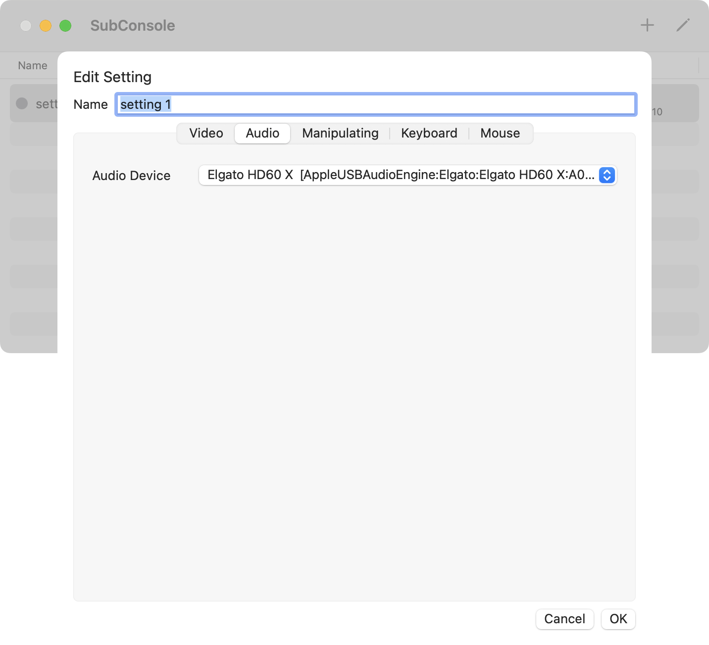

# SubConsole

SubConsole is MacOS Application which provides display and manipulation environment.

English / [日本語](https://ikemax2.github.io/SubConsole/README_jp.html)

## Outline
This Application run on MacOS, provides display environment from external terminal and manipulation environment to it.

A set of Display, Keyboard, Mouse can be switched between Host terminal and multiple Guest terminals at any time. This feature provide you saving space of your desk and improvement efficiency of your work. 

Although It has the same features as a KVM(Keyboard/Video/Mouse) Switcher, SubConsole differs from a typical KVM Switcher in the following ways,

- switching is performed by software on the Host terminal, so no hardware is required.
- It perform flexible switching, which can reduction display the video output from the multiple terminals at same time, can display it to two displays of Host terminal respectively.
- Capture Device is required for each Guest terminal in order to input video output from it.
- Keyboard/Mouse Emulator is required for each Guest terminal in order to output  keyboard/mouse operation of host terminal to it.

The Mac with Apple Silicon allows you following,

- It can display high resolution and high reflesh rate without occupaying much CPU/GPU time, you can manipulate guest terminal with low latency without preventing other your tasks on host terminal.
- The Metal 3 API upscaling technology enables sharp video with clear edge, for example, 1080p video from PC to be displayed full screen on a 5K monitor as if it were a directly connected display.

## Requirement

This application is intended to run in following environments,
- Mac with Apple Silicon (as Host terminal)
- Display, keyboard and mouse are connected to the Mac
- The Video/Audio Capture Device is connected to the Mac
- The Keyboard/Mouse Emulator is connected to the Mac
- The video from guest terminal is input to the capture device above
- The Keyboard/Mouse Emulator above is connected to the guest terminal

For low latency operation, it is recommended to use capture devices capable of  capturing at 60Hz or higher.

This application is supported MR-CH9329EMU-USB as Keyboard/Mouse Emulator.
http://minnanolab.net/product/pro_keyboardmouse/pro_keyboardmouse.html

This application has been developed in following environments,

- host terminal     : Mac mini 2023(Apple M2 Pro/Memory 16GB/MacOS 15.3.2)
- display    : Studio Display (Apple, 5120x2880 Retina)
- capture device : Elgato HD60 X
- keyboard/mouse emulator  : MR-CH9329EMU-USB (Minna-no-lab)

## Install
- Download the package to your mac from [this page](https://github.com/ikemax2/SubConsole/releases), copy it to Application folder.
- Or, fetch the source from [this repositry](https://github.com/ikemax2/SubConsole), compile it.   
  Serial communication Library "SerialGate" is required.
  https://github.com/Kyome22/SerialGate.git  
  (The dependencies is already setted in Xcode Project, SerialGate will be downloaded automatically in scheme of Swift Package.)

## Usage
- Connect the capture device and keyboard/mouse emulator to the host and guest terminals, and launch the application.
- The following dialog box will appear when tha application is launched at first time.  
  Click the "Allow" button to allow video/audio capturing to the application by 

  

- The List Window will appear when the application has launched. Click the "+" icon in the upper right corner of the window to add the new setting.
- Click the pencil icon to edit the saved setting.

- After adding the setting, double-Click on the row of the setting to open a new Console Window. The captured video will appear in the window. While the window is in focus, the keyboard/mouse operation are output to the guest terminal via the keyboard/mouse emulator.
- Click the green button in the upper left corner of the window to go to full screen.
- Title bar of the window will appear again if the mouse cursor is moved to the top edge of the display while in full-screen mode.
- Press the Ctrl + left / right arrow keys in full-screen mode to switch screens  
   (Default keyboard shortcut in Mac)

### Video Setting

#### Video Device
Select the Video Capture Device.
The unique ID of the device will appear in parentheses. This application can handle multiple devices of the same type at the same type.

#### Video Format
Select the format video capturing.

- "PixelFormat" represents the data format type from the capture device. This application supports only "420v". "420v" means "Planar Component Y’CbCr 8-bit 4:2:0".

- "Dimension" represents the resolution of the video which is Horizontal(pixel) x Vertical(pixel).

- "FrameRate" represents the number of captures per second. From the standpoint of operational latency, 60 Hz or higher is recommended.

#### Window
- "Open Window in full Screen" if this is checked, the Console Window go to full-screen mode immediately after it is opened from the List Window.

- "Prevent Display Sleep" if this is checked, prevent the display go to sleep when manipulation device is not setted. This setting is not necessary when the manipulation device is setted, since the display will not sleep while you operate the keyboard or mouse.

### Audio Setting

#### Audio Device
Select the Audio Capture Device.The unique ID of the device will appear in parentheses. This application can handle multiple devices of the same type at the same type.

### Manipulating Setting

#### Device Type 
Select the Keyboard/Mouse emulator device type.

This application supoprts only "CH9329".
CH9329 is an IC(:integrated circuit) by semiconductor vendor WCH that emulates the operation of a USB keyboard or mouse in response to commands received via serial communication. 
"MR-CH9329EMU-USB" is a product with a buit-in USB/serial converter IC that can be connected to a host termail via USB.
The connected MR-CH9329EMU-USB is recognized as a USB/serial converter from the host terminal.

#### Port
Select the serial communication port to which CH9329 is connected.

A list of ports recognized by the Mac as serial communication port is displayed.

"/dev/cu.usbserial-xxx" will appear when MR-CH9329EMU-USB is connected to Mac, select the appropriate one.

#### BaudRate
Select the modulation rate on the serial communication at which the CH9329 communicates. In serial communication by RS-232c, the modulation rate is same as  the communication speed.

To communicate the CH9329, the same rate as that set for the CH9329 must be selected here. The default rate is 9600 for the CH9329.

When change the BaudRate, Click the "Reflesh" in "Chip Information" to confirm the connection to CH9329. If you don't know the BaudRate which is setted to CH9329, repeat changing the rate and clicking the "Relesh" until "Chip Status" become to "alive".

#### Chip Status
Show the status of "CH9329".

If the Mac is able to communicate with CH9329 and receives a successfull response from CH9329, it displays "alive"; otherwise, it displays "not confirmed".

When MR-CH9329EMU-USB is used and guest terminal is powered off, it always displays "not confirmed" because power is not supplied to the CH9329.

#### Chip Information
Display the parameters saved in CH9329.

#### Write BaudRate To Chip
Set the new modulation rate to CH9329.

This is valid only when "Chip Status" is "alive".  After clicking this button, select a new BaudRate and click "OK" to write the new BaudRate to CH9329.

The new rate will be activated after the CH9329 turned on again.
When you use MR-CH9329EMU-USB, disconnect it from guest terminal and reconnect it. 
After that re-select the same BaudRate that is written to the chip for this application.
　　
#### Factory Reset
Reset CH9329 to factory settings.

This is valid only when "Chip Status" is "alive". Press this button, and then press the "OK" button to return to the factory default settings. 

### Keyboard Setting
N/A

### Mouse Setting

#### Command Type
Select the command type for the location of mouse cursor.

- When "Absolute" is selected, absolute coordinates are used to indicate the location of mouse cursor. This Application convert the mouse cursor location on Console Window to the coordinate on the screen, send it to the guest terminal.

- When "Relative" is selected, relative coordinates are used to indicate the location of mouse cursor. This Application periodically sends the mouse cursor movement to the guest terminal.
 
　　
#### Frame Type
Select the frame type for mouse cursor location.

- When "Top-Left" is selected, in case of "Absolute" command type, the origin is the upper left corner of the screen, and the X coordinate value increases as you go to the right, and the Y coordinate value increases as you go down. In case of "Relative" command type, the amount of movement in the X direction increases as the mouse cursor moves to the right of the screen, and the amount of movement in the Y direction increases as the mouse cursor moves downward on the screen.

- When "Bottom-Left" is selected, in case of "Absolute" command type, the origin is the lower left corner of the screen, and the X coordinate value increases as you go to the right, and the Y coordinate value increases as you go up. In case of "Relative" command type, the amount of movement in the X direction increases as the mouse cursor moves to the right of the screen, and the amount of movement in the Y direction increases as the mouse cursor moves upward on the screen.

　　
