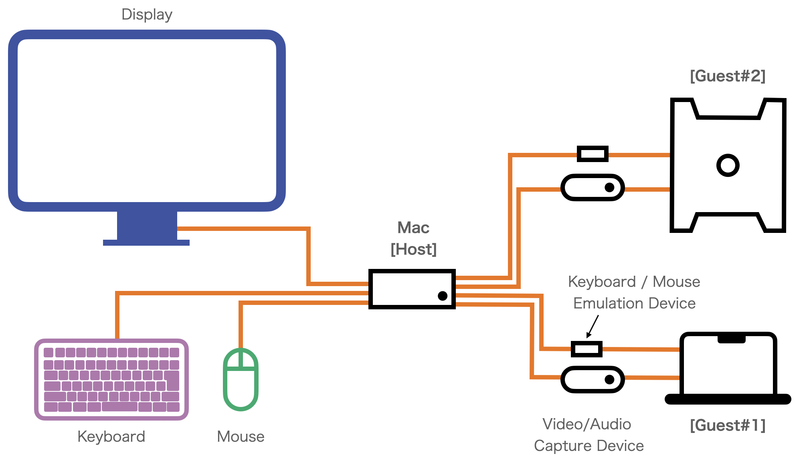
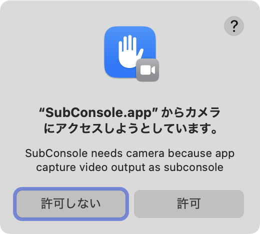
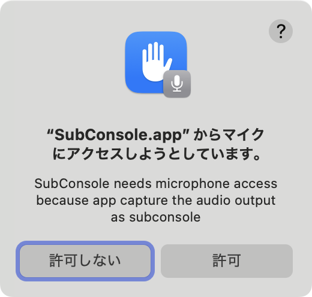
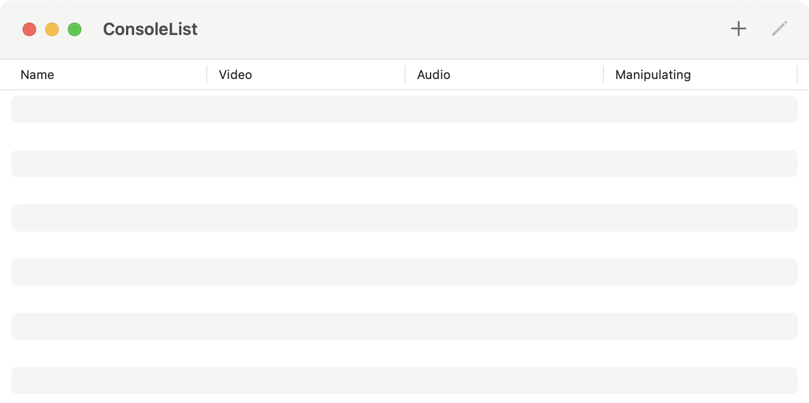
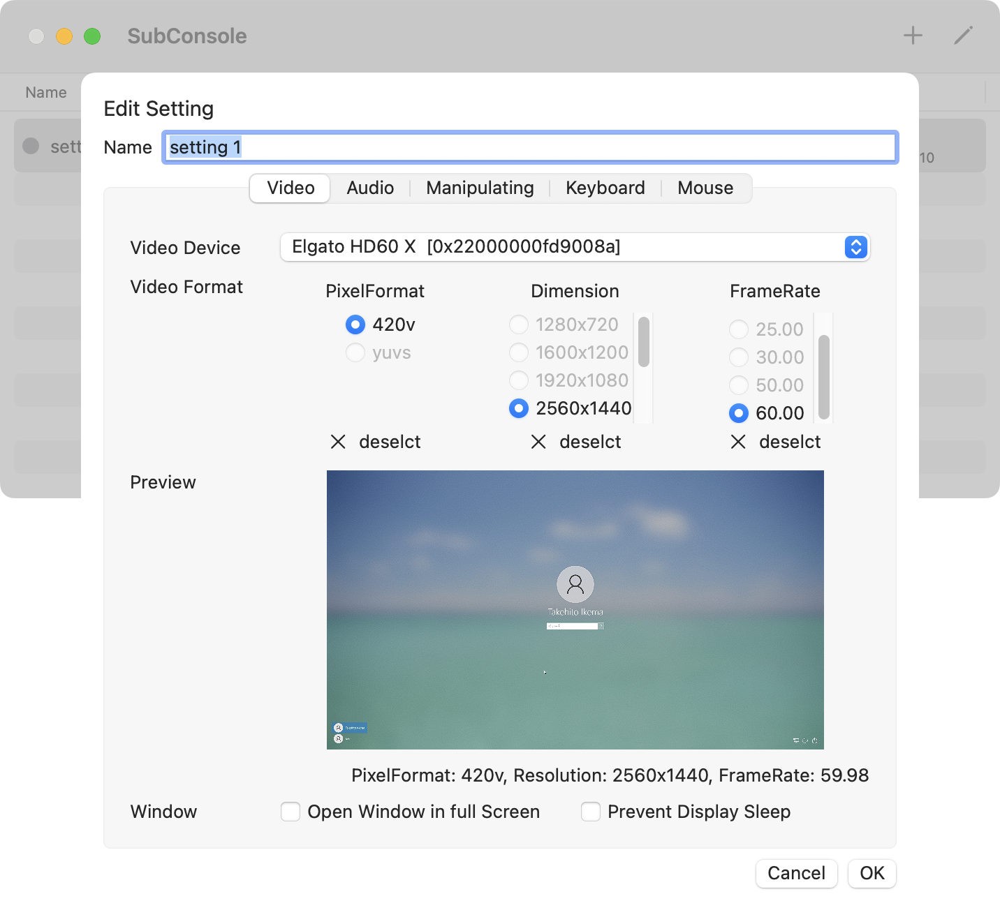
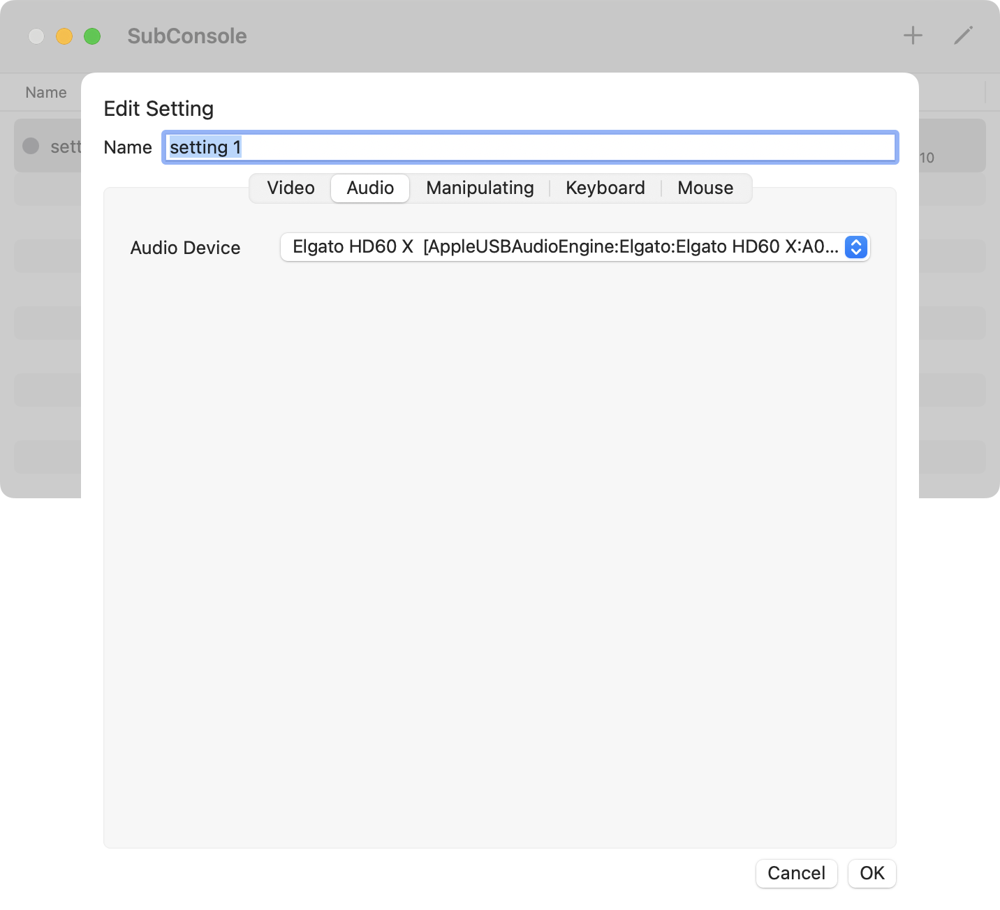
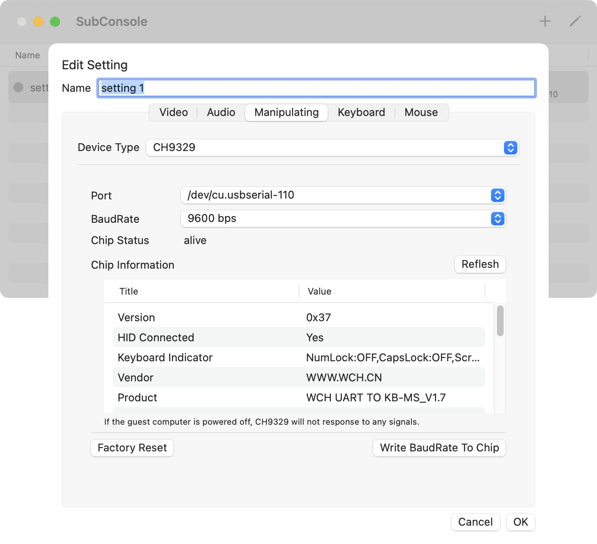
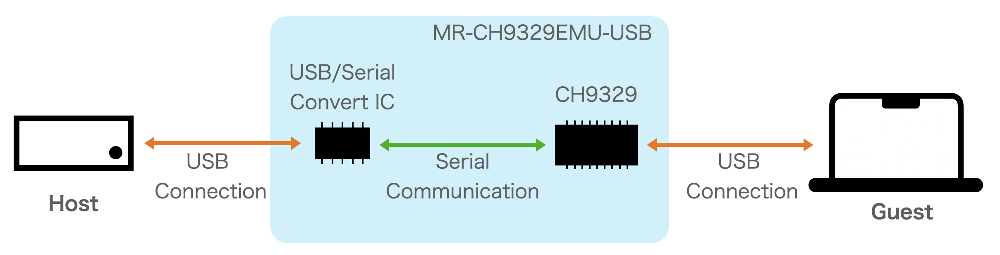
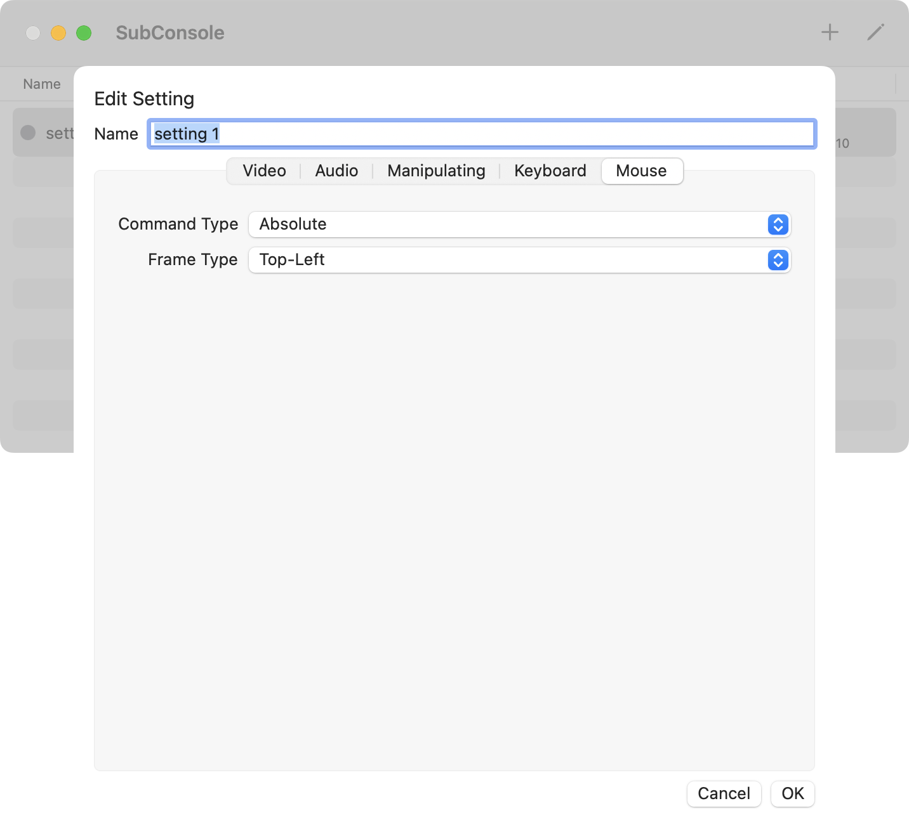

# SubConsole

SubConsoleは、外部端末の画面表示と操作環境を提供する MacOS アプリケーションです。

[English](https://ikemax2.github.io/SubConsole/) / 日本語

## 概要
このアプリケーションはMacOS上で稼働し、外部端末が出力する画面の表示と、その端末の操作環境を提供します。
1組のモニタ、キーボードやマウスを、ホスト端末となるMacと複数のゲスト端末の間で随時
切り替えながら使用することができます。これにより、デスク上のスペースを節約したり作業効率の
向上を図れます。

いわば、KVM(Keyboard/Video/Mouse)スイッチと同じ役割を果たすソフトウェアです。
一般的なKVMスイッチとは以下の点が異なります。
- 切り替えはホスト端末のソフトウェア上で行い、切り替えのためのハードウェアは不要です
- 切り替えをソフトウェアで行うため、一画面に複数端末の画面を縮小表示させたり、ホスト端末の二画面にそれぞれゲスト端末の画面を表示させるなど、柔軟な切り替えが可能です。
- ゲスト端末ごとにその画像出力をホスト端末に入力するためのキャプチャ機器が必要です。
- ホスト端末のキーボード/マウス操作をゲスト端末に出力するためのキーボード/マウスエミュレータがそれぞれ必要です。

Apple Siliconを搭載したMacの能力により、以下が可能です。
- 低いCPU/GPU占有で、高解像度かつ高リフレッシュレートでの画面表示が可能で、ホスト端末での他の作業を妨げず、低遅延での操作が可能です。
- Metal 3 APIによるアップスケーリング技術により、エッジの鮮明な映像を表示できます。  
例えば、PCからの1080pの映像を5K解像度のモニターにフルスクリーンで表示し、まるで直接接続したディスプレイのように表示できます。

## 要件

このアプリケーションは、以下のような環境で実行することを想定しています。
- Apple Silicon を備えたMac(ホスト端末)
- そのMacにはディスプレイ、キーボード、マウスが接続されていること
- そのMacには、キャプチャ機器が接続されていること
- そのMacには、キーポード/マウスエミュレータ が接続されていること
- ゲスト端末からの出力画像は、前述のキャプチャ機器に入力されていること
- ゲスト端末には、前述のキーボード/マウスエミュレータ が接続されていること

遅延の少ない操作のために、60Hz以上のレートでキャプチャが可能な機器をお勧めします。
キーボード/マウスエミュレータとして、MR-CH9329EMU-USBに対応しています。
http://minnanolab.net/product/pro_keyboardmouse/pro_keyboardmouse.html

開発は以下の環境で行いました。
- ホスト端末     : Mac mini 2023(Apple M2 Pro/Memory 16GB/MacOS 15.3.2)
- ディスプレイ    : Studio Display (5120x2880 Retina)
- キャプチャ機器 : Elgato HD60 X
- キーボード/マウスエミュレータ   : MR-CH9329EMU-USB (みんなのラボ)

## インストール

- [このページ](https://github.com/ikemax2/SubConsole/releases)からパッケージをMacにダウンロードしてApplicationフォルダにコピーしてください。
- あるいは、Xcodeで[このリポジトリ](https://github.com/ikemax2/SubConsole)からソースをfetchしてコンパイルしてください。  
  コンパイルには、シリアル通信ライブラリ SerialGate が必要です。
  https://github.com/Kyome22/SerialGate.git  
  (ソース内、Xcode プロジェクト内で依存関係が設定されており、swift packageの仕組みで自動でダウンロードします。)

## 使用方法

- キャプチャ機器、キーボード/マウスエミュレータを接続して、アプリを起動します。
- 初回起動時、以下のwindowが表示されるので、「許可」ボタンを押して、アプリにキャプチャデバイスによる画像収録と音声収録の許可を与えてください。

  

- アプリが起動すると、Listウインドウが開きます。ウインドウ右上の"+"アイコンのボタンを押して、新たに設定を追加してください。
- 保存した設定は、同じくウインドウ右上の"鉛筆"アイコンのボタンを押して、編集できます。

- 設定を追加後、Listウインドウの行をダブルクリックすると新たにConsoleウインドウが開きます。Consoleウインドウには、キャプチャした映像が表示されます。Consoleウインドウにフォーカスされている間、ゲスト端末へは、キーボード/マウスエミュレータを介して、Macでのキーボード/マウス操作が出力されます。
- Consoleウインドウを画面いっぱいに表示する場合は、ウインドウのタイトルバー左端の緑色のボタンを押してください。
- ウインドウ最大化中に、マウスカーソルを画面の一番上まで移動させると、タイトルバーが再度表示されます。
- ウインドウ最大化中は、Ctrl + 左右矢印キー で 画面の切り替えができます。(Mac標準のキーボードショートカットです)

### Video 設定

#### Video Device
画像キャプチャ機器を選択します。
カッコ内はDeviceに固有のIDを表します。同型の複数の機器に対応できます。

#### Video Format
画像キャプチャのフォーマットを選択します。

- PixelFormatは、デバイスが出力する画像のデータフォーマットを表します。 "420v"のみ対応しています。"420v"は、"Planar Component Y’CbCr 8-bit 4:2:0" と説明されます。 

- Dimensionは、画像の解像度 横(pixel) x 縦(pixel) を表します。

- FrameRateは、1秒間あたりのキャプチャ回数を表します。 操作遅延の観点から、60Hz以上をお勧めします。

#### Window
- Open Window in full Screen : チェックが入っている場合、List ウインドウからConsoleウインドウを開いた直後に最大化します。

- Prevent Display Sleep : チェックが入っている場合、ディスプレイがスリープに移行することを妨げます。Manipulateデバイスが設定されていれば、SubConsole使用中はキーボードやマウスを操作することによってスリープ移行が妨げられますので、設定不要です。Manipulateデバイスを設定していない場合に有効です。

### Audio 設定

Audio Device : 音声キャプチャ機器を選択します。カッコ内はDeviceに固有のIDを表します。同型の複数の機器に対応できます。

### Manipulating 設定

#### Device Type 
キーボード/マウスエミュレータの種類を選択します。

"CH9329"のみ対応しています。"CH9329"は、半導体メーカー WCHによるIC(集積回路)で、シリアル通信によるコマンドに従って、USBキーボード/USBマウスの振る舞いをエミュレーションします。  
"MR-CH9329EMU-USB"は、このCH9329にUSBシリアル変換ICを接続して、ホスト端末側ともUSB接続できるようにした製品です。ホスト端末からは、接続したMR-CH9329EMU-USBは、USB/シリアル変換器として認識されます。

#### Port
CH9329が接続されているシリアル通信ポートを選択します。

Macがシステムとして認識している シリアル通信ポートの一覧が示されます。 MR-CH9329EMU-USBをMacに接続している場合、 "/dev/cu.usbserial-xxx"として表示されますので、対応するものを選択してください。

#### BaudRate
CH9329と通信するためのシリアル通信上の変調速度を選択します。RS232Cに基づくシリアル通信では、変調速度(Baud)は通信速度(bps:bit per second)と同じ値になります。

CH9329と通信するために、CH9329に設定された速度と同じ値をここで選択する必要があります。CH9329に設定されているデフォルト値は 9600 です。
変調速度を選択した場合は、"Chip Information" の "Reflesh"ボタンを押して通信できるか確認してください。選択すべき変調速度が不明な場合、"Chip Status"が"alive"となるまで変調速度の変更とリフレッシュ操作を繰り返してください。

#### Chip Status
CH9329との状態を示します。

CH9329と通信できていて、コマンドに対してCH9329から正常な反応がある場合に"alive"と表示します。それ以外の場合は"not confirmed"と表示します。  
MR-CH9329EMU-USBの場合、ゲスト端末の電源がオフになっている場合はCH9329に電力が供給されないため、常に"not confirmed"となります。

#### Chip Information
CH9329に保存されている各種パラメータを表示します。

#### Write BaudRate To Chip
CH9329に新たなシリアル通信上の変調速度を設定します。

Chip Statusが "alive"の時にのみ有効です。ボタンを押した後、変更後の"New BaudRate"を選択し、"OK"ボタンを押すことで新しい変調速度をCH9329に書き込みます。  
CH9329の電源が切れ、再度入った時から新しい変調速度が有効になります。  
MR-CH9329EMU-USBを使っている場合は、ゲスト端末から取り外し、再度接続してください。その後、このアプリで、BaudRateを書き込んだ変調速度と同じ値に設定し直してください。
　　
#### Factory Reset
CH9329を工場出荷時の設定に戻します。

Chip Statusが "alive"の時にのみ有効です。ボタンを押した後、"OK"ボタンを押すことでCH9329を工場出荷状態に戻します。

### Keyboard 設定
N/A

### Mouse 設定

#### Command Type
マウスカーソルの位置の指示方法を選択します。
- "Absolute"の場合、マウスカーソルの指示方法として、絶対座標を用います。Consoleウインドウ上でのマウスカーソルの位置を、画面上の絶対座標としてゲスト端末に送信します。
- "Relative"の場合、マウスカーソルの指示方法として、相対座標を用います。マウスカーソルの移動量を一定の時間間隔で、ゲスト端末に送信します。
　　
#### Frame Type
マウスカーソルの座標の種類を選択します。
- "Top-Left"の場合、絶対座標指示の場合、画面の左上隅を原点とし、右方向に行くほどX座標値が大きくなり、下方向に行くほどY座標値が大きくなります。相対座標指示の場合、マウスカーソルが画面の右方向に行くとX方向移動量を大きくなり、画面の下方向に行くほどY方向移動量が大きくなります。
- "Bottom-Left"の場合で、絶対座標指示の場合、画面の左下隅を原点とし、右方向に行くほどX座標値が大きくなり、上方向に行くほどY座標値が大きくなります。相対座標指示の場合、マウスカーソルが画面の右方向に行くとX方向移動量が大きくなり、画面の上方向に行くほどY方向移動量が大きくなります。

#### Cursor Type
マウスカーソル表示の種類を選択します。
- "System Default"の場合、Mac OSが表示するカーソルは通常の状態です。このとき画面には、Mac OSが表示するマウスカーソルと、ゲスト端末が表示するマウスカーソルのどちらも表示されます。
- "Dot"の場合、Mac OSが表示するカーソルは、小さなドット形状に変わります。
- "Empty"の場合、カーソルは非表示になります。画面には、ゲスト端末が表示するマウスカーソルだけが表示されます。

　　
